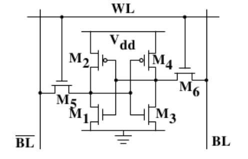
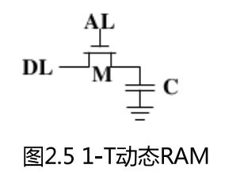
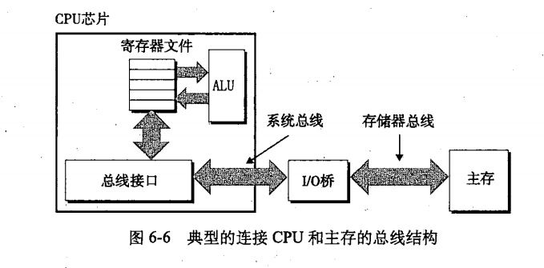
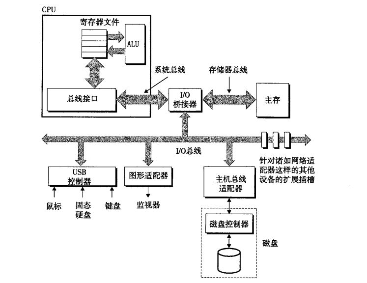
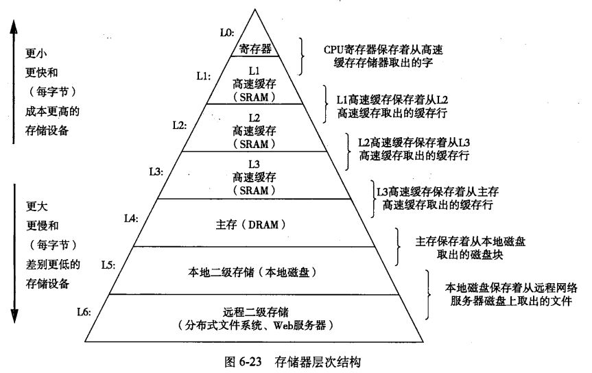
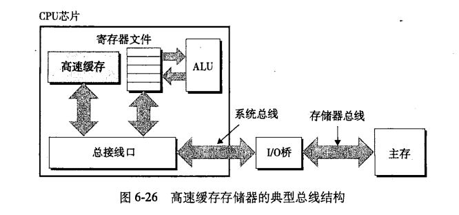
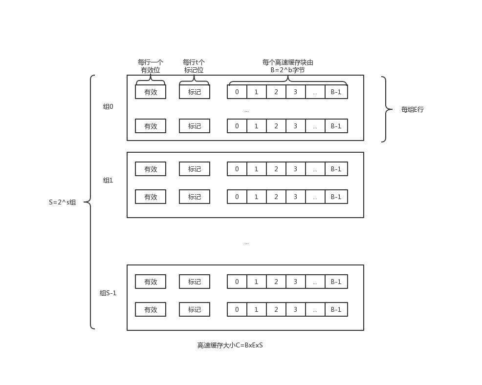
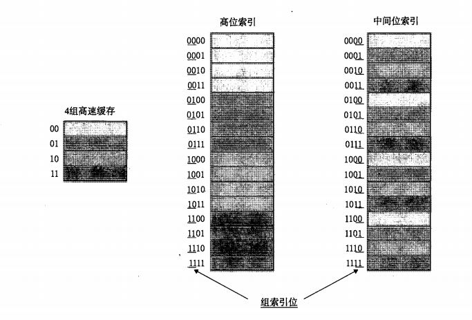
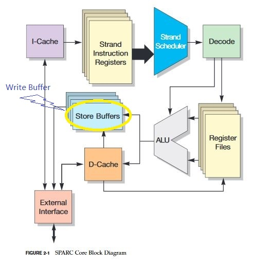

# 存储器层次结构

## 内存

- 静态RAM（SRAM）



- 动态RAM（DRAM）



- `闪存`(flash memory):一类非易失性存储器,基于`EEPROM`(电子可擦除PROM(Electrically Erasable PROM))
- `固件`(firmware): 存储在ROM(Read-Only Memory)设备中的程序



* I/O桥的作用---`翻译`
> I/O桥将系统总线（system bus）的电子信号翻译成存储器总线（memory bus）的电子信号

### 示例：读取内存数据

```
movl A %eax
```
> 将地址A的内容加载到寄存器%eax中

- CPU将地址A放到存储总线上
- 主存从总线读取A，取出字x，然后将x放到总线上
- CPU从总线上读出字x，并将其拷贝到寄存器%eax中

## 磁盘存储



读磁盘操作：
- CPU通过命令、逻辑块号和目的存储器地址写到与磁盘相关的存储器映射地址，发起一个磁盘读操作
- 磁盘控制器读扇区，并执行到主存的DMA传送
- 当DMA传送完成时，磁盘控制器用`中断`的方式通知CPU

## 局部性

> `局部性原理`：编写程序时，倾向于引用邻近于其他最近引用过的数据项的数据项，或者最近引用过的数据项本身。

局部性：时间局部性（temporal locality）和空间局部性（spatial locality）
- 时间局部性：被引用过一次的存储位置很可能在不远的将来再被多次引用
- 空间局部性：如果一个存储位置被引用一次，那么程序很可能在不远的将来引用附近的一个存储器位置

局部性原理允许计算机设计者通过引入称为的`高速缓存存储器`的小而快速的存储器来保存最近被引用的指令和数据项，从而提高对主存的访问速度。

## 存储器层次结构



### 缓存

高速缓存（cache）是一个小而快速的存储设备，它作为存储在更大、也更慢的设备中的数据对象的缓冲区域。
> 缓存（caching）：使用高速缓存的过程

- 缓存命中（Cache Hit）
- 缓存不命中（Cache Miss）
  - 覆盖现有缓存的块的过程叫`替换`（replacing）或`驱逐`（evicting）
  - `替换策略`（replacement policy）: 最近最少被使用（LRU）替换策略的缓存选择那个最后被访问的时间距现在最远的块

### 缓存管理

存储器分层结构的本质: `每一层存储设备都是较低一层的缓存`

> - L1、L2、L3层的缓存完全是由内置在缓存中的硬件逻辑来管理
> - DRAM主存作为存储在磁盘上数据块的缓存，是由`操作系统`软件和`CPU上的地址翻译硬件`(TLB)共同管理

| 类型  | 缓存什么  | 被缓存在何处  | 延迟（周期数）  | 由谁管理 |
|:-:|:-:|:-:|:-:|:-:|
| CPU寄存器  | 4字节或8字节字  | 芯片上的CPU寄存器  | 0  | 编译器  |
| TLB  | 地址翻译  | 芯片上的TLB  | 0  | 硬件MMU  |
| L1高速缓存  | 64字节块  | 芯片上的L1高速缓存  | 1  | 硬件  |
| L2高速缓存  | 64字节块  | 芯片上/下的L2高速缓存  | 10  | 硬件  |
| L3高速缓存  | 64字节块  | 芯片上/下的L3高速缓存  | 30  | 硬件  |
| 虚拟存储器  | 4KB  | 主存  | 100  | 硬件+OS  |
| 缓冲区存储  | 部分文件  | 主存  | 100  | OS  |
| 磁盘缓存  | 磁盘扇区  | 磁盘控制器  | 100 000  | 控制器固件  |
| 网络缓存  | 部分文件  | 本地磁盘  | 10 000 000  | AFS/NFS客户端  |

> TLB: 翻译后备缓冲器（Translation Lookaside Buffer）
> - 延迟周期随CPU性能的提高越来越短

## 高速缓存存储器



### 通用的高速缓存存储器结构

在CPU中存储器地址线的个数m，将决定其寻址的范围`$M=2^m$`个不同的地址。

高速缓存主要是将主存中的数据以一定的方式或者策略映射其中，以提高CPU的读写速度，减少数据访问周期。而映射到在Cache中的数据可以被CPU访问同样是通过地址检索，为了提高CPU检索的速度，将地址进行了划分，分成不同的组（Cache set），每个组分成不同行（Cache line）， 每个行分成不同的数据块（block）来提高访问速度。

地址划分如下：


|      类型      | 位宽 |                        含义                         |
|:--------------:|:----:|:---------------------------------------------------|
|   标记(tag)    |  t   |   用来确定该地址属于哪个高速缓存行（Cache line）    |
| 组索引(index)  |  s   |    用来确定该地址属于哪个高速缓存组（Cache set）    |
| 块偏移(offset) |  b   | 用来确定该地址属于高速缓存行中的哪个数据块（block） |
> 注： m = t + s + b

不同的分类将Cache组织起来，高速缓存（S，E, B, m）的通用组织：

高速缓存是一个高速缓存组（Cache set）的数组，每一个组包含一个或多个行，每个行包含一个有效位、一些标记位、以及一个数据块
> 高速缓存的大小：`C = S x E x B`

#### 相关参数

| 参数  | 描述  |
|:---------:|:-----|
| $S=2^s$  | 组数  |
| $E$  | 每个组行数  |
| $B=2^b$  | 块大小（字节）  |
| $m=log_2(M)$  | (主存物理地址位数)  |
| $M=2^m$  | 存储器地址最大数量  |
| $s=log_2(S)$  | 组索引位数量  |
| $b=log_2(B)$  | 块偏移位数量  |
| $t=m-(s+b)$  | 标记位数量  |
| $C=S\times E\times B$  | 不包含有效位和标记位这样开销的高速缓存大小（字节）  |

#### 地址检索流程

1. 组选择，依据`组索引`
2. 行匹配，依据`标记位`
3. 字抽取，依据`块偏移`

#### 为什么用中间的位做索引？

如果使用高位做索引，那么一些连续的存储器块就会映射到相同的高速缓存块中


### 直接映射高速缓存（direct-mapped cache）

> 每一个组中只有一行高速缓存（E=1）

- 缓存命中（Cache hit）
- 缓存不命中（Cache miss）
  - 需要从存储器层次结构中的下一层取出被请求的块，然后将新块存储在组索引位指示的组中的一个高速缓存行中。由于直接映射组中只有一个高速缓存行，因此可以直接替换。

> 直接映射高速缓存中容易产生`冲突不命中`,从而降低高速缓存的性能

### 组相联高速缓存

> 每组都保存有多于一个的高速缓存行，一个`1<E<C/B`的高速缓存通常称为`E路高速缓存`

- 缓存命中（Cache hit）
- 缓存不命中（Cache miss）
  - 替换策略：
    - 最不常使用(Least-Frequently-Used, LFU)
    - 最近最少使用(Least-Recently-Used, LRU)

### 全相联高速缓存

> 由一个包含所有高速缓存行的组（即E=C/B）组成的

因为只有一个组，所以此时就没有组索引位s=

### 有关写的问题

- 直写(write-through): 就是立即将改动的高速缓存块写回到紧接着的底一层中
  - 缺点就是每次写都会引起总线流量
- 回写(write-back): 尽可能的推迟存储器更新，只有当替换算法要替换更新过的块时，才把他写入紧接着的底一层中。
  - 缺点增加复杂度，高速缓存必须为每一个高速缓存行维护一个额外的`修改位(dirty bit)`，表明这个高速缓存行是否被修改过

#### 写不命中处理

- 写分配(write-allocate)：加载相应的底一层中的块到高速缓存中，然后更新这个高速缓存
- 非写分配(not-write-allocate)：避开高速缓存，直接把这个字写到底一层中

> 直写高速缓存通常是非写分配； 回写高速缓存通常是写分配

#### Write/Store Buffer

现代的处理器往往引入`Write/Store Buffer`来提升存储系统的性能。Write Buffer的位置位于`L1 D-Cache`与`下一级存储器`之间

> CPU架构：Open SPARC T1



## 参考

* [OpenSPARC™T1 Microarchitecture Specification](https://www.oracle.com/technetwork/systems/opensparc/t1-01-opensparct1-micro-arch-1538959.html)
